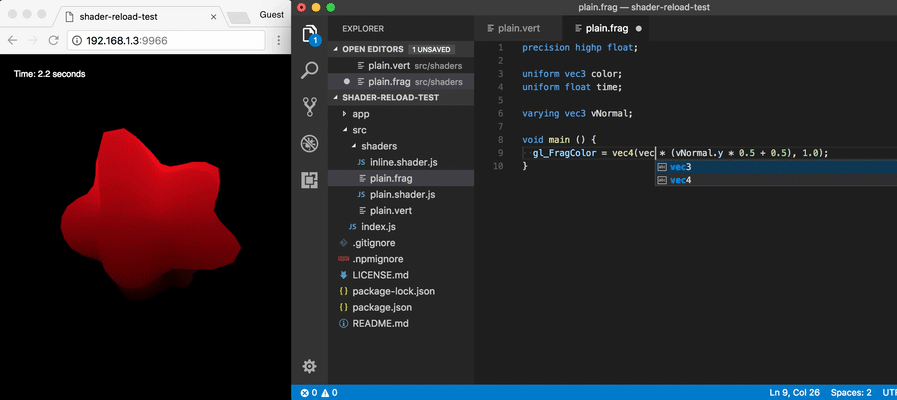

# shader-reload

[](http://github.com/badges/stability-badges)

This is an experimental interface for live shader reloading in ThreeJS, [regl](https://github.com/regl-project/regl/), and other WebGL frameworks. This means you can edit your GLSL shader files without re-starting your entire application state. Works with regular strings, template strings, and/or transforms like brfs and [glslify](https://www.npmjs.com/package/glslify). Handles errors with a client-side popup that disappears on subsequent reloads.

[](https://twitter.com/mattdesl/status/944246533016424453)

> See [this tweet](https://twitter.com/mattdesl/status/944246533016424453) for a longer video.

This also includes `glsl-server`, a drop-in replacement for [budo](https://www.npmjs.com/package/budo) that supports live-reloading GLSL with `glslify` built-in.

The code here could probably be adapted to work with other environments, e.g. Webpack/Express.

## Quick Start

This module includes `glsl-server`, a simple development server to get you up and running. For advanced projects, you may choose to use another [development tool](#development-tool).

From your project folder using `node@8.4.x` and `npm@5.3.x` or higher:

```sh
npm install shader-reload --save-dev
```

Add a simple `index.js` script like this:

`index.js`

```js
const shader = require('./foo.shader');

// Initial source
console.log(shader.vertex, shader.fragment);

shader.on('change', () => {
  // New source
  console.log('Shader updated:', shader.vertex, shader.fragmetn);
});
```

It requires a shader module (which must have a `.shader.js` extension) with the following syntax.

`foo.shader.js`

```js
module.exports = require('shader-reload')({
  vertex: '... shader source string ...',
  fragment: '... shader source string ...'
});
```

Now you can start the development server and begin editing & developing your application. Saving the shader modules will trigger a `'change'` event without a hard page reload, but saving any other modules will reload the page as usual.

```sh
# opens the browser to localhost:9966/
npx glsl-server src/index.js --open
```

> :bulb: Under the hood, the `glsl-server` script is running [budo](https://www.npmjs.com/package/budo) with [glslify](https://www.npmjs.com/package/glslify), so you can pass other options like `--dir` and `--port`. You can also add glslify transforms like [glslify-hex](https://www.npmjs.com/package/glslify-hex) to your package.json and they will get picked up by `glsl-server`.

## Details

### Shader Files (`.shader.js`)

You will need to separate your shader source into its own module, which must have the extension `.shader.js` and require the `shader-reload` function.

Pass statically analyzable GLSL source code to the function like this:

```js
module.exports = require('shader-reload')({
  vertex: '... shader source string ...',
  fragment: '... shader source string ...'
});
```

The return value of the `shader-reload` function is a `Shader` object, which has the same `vertex` and `fragment` properties (which are mutated on file change). You can also attach a `shader.on('change', fn)` event to react to changes.

Here is an example with inline shader source, using template strings.

`blue.shader.js`

```js
module.exports = require('shader-reload')({
  fragment: `
  void main () {
    gl_FragColor = vec4(0.0, 0.0, 1.0, 1.0);
  }`,
  vertex: `
  void main () {
    gl_Position = projectionMatrix * modelViewMatrix * vec4(pos.xyz, 1.0);
  }`
});
```

Then your ThreeJS source might look like this:

`main.js`

```js
const shader = require('./blue.shader');

const material = new THREE.ShaderMaterial({
  vertexShader: shader.vertex,
  fragmentShader: shader.fragment
});

shader.on('change', () => {
  // Mark shader for recompilation
  material.vertexShader = shader.vertex;
  material.fragmentShader = shader.fragment;
  material.needsUpdate = true;
});

const mesh = new THREE.Mesh(geometry, material);
...
```

The examples include a [LiveShaderMaterial](./example/materials/LiveShaderMaterial.js) which is a bit more robust for large applications.

### Development Tool

Other than the `.shader.js` modules, you also need to have this set up with your development tool. You have a few options:

- Use the `glsl-server` script that comes with this module, it already includes glslify and shader reloading out of the box
- Attach shader reloading to [budo](https://www.npmjs.com/package/budo), see [this gist](https://gist.github.com/mattdesl/ad4542d7a21e920b8ad0fba0c8e8e947) for instructions or look through the implementation in [./bin](./bin)
- Attach shader reloading to your existing development environment using WebSockets and broadcasting `'shader-reload'` events to clients

### Browserify Transform

If you are using `glsl-server`, it already includes the transforms needed for shader reloading and glslify.

If you are using budo directly or your own browserify scripts, you will need to include a source transform, e.g. `-t shader-reload/transform`, or in options:

```js
...
  browserify: {
    transform: [ 'shader-reload/transform' ]
  }
```

## Use with glslify

The `glsl-server` script already includes glslify support out of the box, so you can organize your shaders into their own files and require glsl modules from npm:

`blue.shader.js`

```js
const glslify = require('glslify');
const path = require('path');

module.exports = require('shader-reload')({
  vertex: glslify(path.resolve(__dirname, 'blue.vert')),
  fragment: glslify(path.resolve(__dirname, 'blue.frag'))
});
```

If you are using budo directly or your own development server, make sure to include `glslify` as a source transform *before* the `shader-reload` transform.

## :warning: Babel and ES6 `import`

Babel will replace `import` statements with code that isn't easy to statically analyze, causing problems with this module. Instead of using `import` for `'shader-reload'`, you should `require()` it.

The same goes for requiring `glslify`.

## Production Bundling

During production or when publishing the source to a non-development environment (i.e. without WebSockets), simply omit the `shader-reload` transform. Shaders will not change after construction.

If you are using `glsl-server` and looking for a final JavaScript file for your static site, you can use browserify:

```sh
# install browserify
npm i browserify --save-dev

# bundle your index, with glslify if you need it
npx browserify index.js -t glslify > bundle.js
```

## API Doc

#### `shader = require('reload-shader')(shaderSource)`

Pass in a `shaderSource` with `{ vertex, fragment }` strings, and the `Shader` emitter returned will contain the following:

```js
shader.vertex   // the latest vertex source
shader.fragment // the latest fragment source
shader.version  // an integer, starts at 0, increased with each change
shader.on('touch', fn)  // file was touched by fs file watcher
shader.on('change', fn) // vertex or fragment source was changed
```

#### `require('reload-shader/receiver').on('touch', fn)`
#### `require('reload-shader/receiver').on('change', fn)`

This event is triggered after all shaders have been updated, allowing you to react to the event application-wide instead of on a per-shader basis.

## Running from Source

Clone this repo and `npm install`, then `npm run example-three` (ThreeJS) or `npm run example-regl` (regl). Edit the files inside the [example/shaders/](./examples/shaders/) folder and the shader will update without reloading the page. Saving other frontend files will reload the page as usual, restarting the application state.

## Why not Webpack/Parcel HMR?

In my experience, trying to apply Hot Module Replacement to an entire WebGL application leads to a lot of subtle issues because GL relies so heavily on state, GPU memory, performance, etc.

However, shaders are easy to "hot replace" since they are really just strings. I wanted a workflow that provides lightning fast GLSL reloads, works smoothly with glslify, and does not rely on a bundle-wide HMR solution (which would be overkill). This module also handles some special edge cases like handling shader errors with a client-side popup.

## License

MIT, see [LICENSE.md](http://github.com/mattdesl/shader-reload/blob/master/LICENSE.md) for details.
